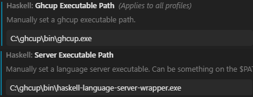

# IDE

## VS Code
Является рекомендацией разработчиков языка. Если вы использовали `GHCup` при установке и все нужные исполняемые файлы находятся в `PATH`, то все должно работать из коробки

* [Основной плагин](https://marketplace.visualstudio.com/items?itemName=haskell.haskell)
* [Подсветка синтаксиса](https://marketplace.visualstudio.com/items?itemName=haskell.language-haskell)

При проблемах с плагином, попробуйте явно указать путь до Ghcup и Haskell Language Server  

## Jet Brains
Для любой IDE от Jet Brains доступен [плагин](https://plugins.jetbrains.com/plugin/24123-haskell-lsp), поддерживающий `Haskell Language Server`. На версиях <= 2025 плагин может работать не стабильно. По крайней мере, я не смогу его адекватно у себя завести. Если у вас получится сделать это без танцев с бубном - сообщите :smirk:
